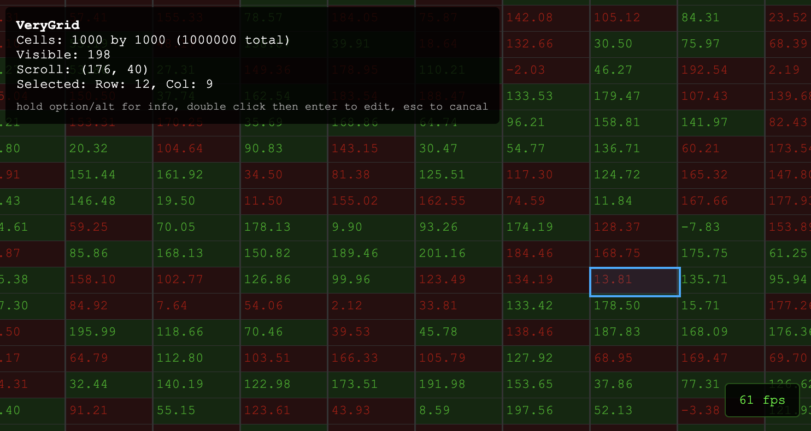

# verygrid

## What

A massive data grid experiment.

## Implementation notes

- GPU rendering with **cell data and colour stored in GPU**
- Shaders used for parallel updates
- Vertex shader handles virtualization
- Text and editing rendered on overlay canvas

## Demo

Demo with 1m cells https://xllify.com/verygrid/

**Try scrolling around a bit and hit option/alt for some stats. Check your CPU/GPU load.**

Video https://vimeo.com/1122933743

Currently desktop only. You will need to toggle the WebGPU feature flag on macOS/iOS Safari.

## Why

Sometimes a lot of high velocity data needs to be shown across several high resolution screens. Sometimes this is what users want.

Sometimes muscle memory - knowing where to look, what keys to press and what information to radiate is the primary ask. Sometimes there's a LOT going on at the same time which needs to be visible. As ever, interfaces need to remain responsive, data should be instantaneous and resource usage should be as low as possible. (A mantra to live by.)

It is therefore disappointing that many data grids on the market, even the expensive commercial ones, perform horribly when showing a lot of fast moving data. Insane memory use, GC pauses, laggy scrolling, browser crashes, painting bugs and so on. I'm not a front end expert so may have been using them incorrectly. I also appreciate that this is perhaps outside of their envelope of anticipated use.

Putting all of that aside, out of curiosity, I built a massive grid that leverages WebGPU!
